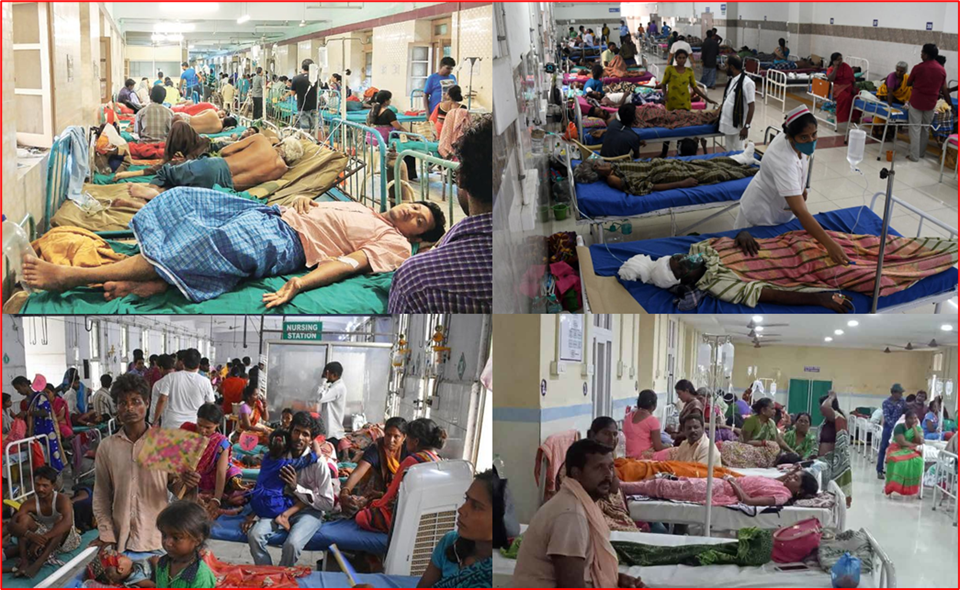
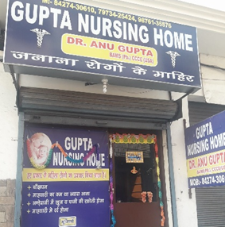
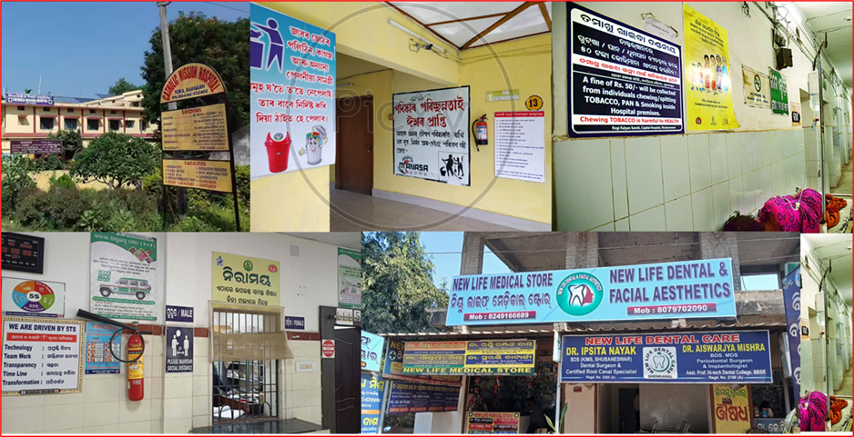
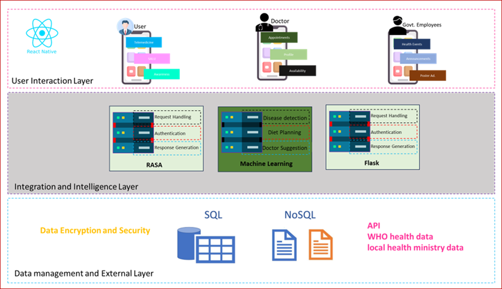
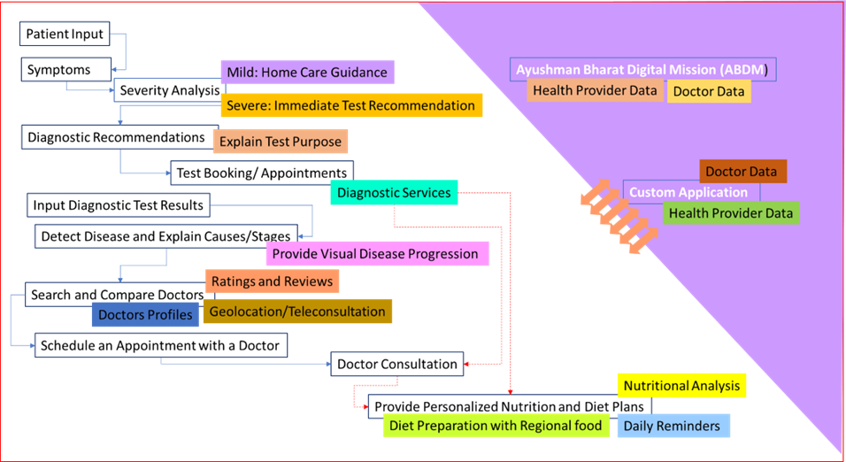

# **SALU – Smart AI Assistant for Life and Uttam Healthcare**  

## **Overview**  
Healthcare in rural areas of middle- and low-income countries faces critical challenges, including doctor shortages, insufficient medical explanations, limited health literacy, and language barriers. Many patients struggle to access proper healthcare guidance, while individual doctors often lack digital platforms for outreach.  

To address these issues, I am developing **SALU**, an AI-powered digital assistant designed to provide **reliable medical information, test report analysis, and post-treatment guidance** in regional languages.  

## **Technology Stack**  
- **Frontend**: React Native Expo  
- **Backend**: Flask, Rasa  
- **AI/ML**: Natural Language Processing (NLP), Machine Learning  

## **Features**  
✅ Medical information before/after examinations  
✅ Disease and test report analysis  
✅ Nutrition & dietary guidance  
✅ Regional language support  
✅ AI-driven conversational assistant  

## **Motivation**  
Despite rapid advancements in AI, IoT, and digital assistants, rural healthcare remains underserved. **SALU** bridges this gap by leveraging cutting-edge AI to enhance accessibility, understanding, and engagement with healthcare services.  

Here’s a concise version of the healthcare challenges for your **README** file:  

---

## **Challenges in Rural Healthcare** 

Healthcare is facing many challenges, as follows:

### **1. Doctor-Patient Disparity**  
- High population and low doctor availability (1 million doctors for 1.4 billion people in India).  
- Uneven distribution: 58% of doctors serve urban areas, only 18.8% serve rural regions.  
- Limited consultation time (2-3 minutes per patient) leads to insufficient health guidance.

 

### **2. Limited Access to Healthcare Information**  
- Many doctors and hospitals lack digital presence.  
- Most healthcare information is available only in English, creating language barriers.  
- No standardized process to choose the best doctor. 

### **3. Gaps in Post-Treatment Care & Nutrition Guidance**  
- No dedicated nutrition experts for personalized diet planning.  
- Patients rely on informal advice, leading to ineffective recovery.  
- Lack of region-specific dietary recommendations. 

### **4. Lag in Healthcare Digitalization**  
- Government digital health initiatives exist but are yet to reach rural areas effectively.  
- AIIMS and ABDM introduced digital healthcare, but rural adoption remains low.  

### **5. Government Awareness & Communication Barriers**  
- Health programs rely on ineffective communication methods (posters, phone messages, word of mouth).  
- Many rural populations remain unaware of healthcare programs and services. 

### **6. Advancing Healthcare with Technology**  
- AI, IoT, NLP, and digital assistants are transforming industries but are underutilized in rural healthcare.  
- Lack of explainable AI and privacy-preserving techniques in Healthcare 4.0.  

### **7. Transitioning to Healthcare 5.0**  
- Shift from automation to human-centered AI collaboration.  
- Need for trust, data privacy, and explainable AI in rural healthcare.  
- AI-powered assistants can bridge healthcare gaps with multilingual, human-oriented solutions.  

### **Our Solution**  
Our proposed AI-driven digital assistant **SALU** addresses these challenges through:  
✅ **Pre-medical-test analysis**  
✅ **Post-medical dietary recommendations with local food options**  
✅ **Telemedicine & awareness programs**  
✅ **AI-powered healthcare guidance in regional languages**  

---  
### **Methodology**

Our proposed system, **SALU**, is designed to empower rural patients and families by providing a comprehensive health assistance platform. The system is structured across three key layers:

1. **User Interface Layer**: Built using **React Native Expo**, this layer provides a cross-platform interface for patients, doctors, and government employees. Users can input symptoms, access diagnostic suggestions, and interact with the AI-powered assistant.

2. **Integration and Intelligence Layer**: At the core of the system is a **Rasa-based conversational AI assistant**, which uses **Natural Language Processing (NLP)** and machine learning models to analyze health data and provide personalized interactions. The backend, powered by **Flask**, integrates AI models and ensures seamless communication between components.

3. **Data Management and External Layer**: This layer manages sensitive health data securely using encryption and integrates external data sources like diagnostic centers and government platforms (e.g., **Ayushman Bharat Digital Mission**). It also connects with telemedicine platforms and health insurance systems.

### Key Features:
- **SALU AI Assistant**: A chatbot that assists users with symptom analysis, test report interpretation, and diet planning.
- **Arogya Sambad (Telemedicine)**: Enables users to search for doctors, schedule appointments, and conduct virtual consultations.
- **Government Awareness Interface**: Provides updates on public health initiatives and government programs.

### Technical Components:
- **Frontend**: Developed using **React Native Expo** for cross-platform compatibility.
- **Backend**: Powered by **Rasa** for conversational AI and **Flask** for telemedicine integration.
- **Machine Learning**: Models trained for disease prediction (e.g., diabetes, kidney disease) and nutritional analysis using datasets like urine dipstick tests and regional food data.
- **Database**: **PostgreSQL** for managing user profiles, appointments, and health records.
- **APIs**: RESTful APIs for seamless integration with external services like Razorpay for payments and WebSocket for virtual consultations. #TODO

### Workflow:
1. Users input symptoms into the SALU chatbot.
2. The system suggests diagnostic tests and analyzes the results to detect potential diseases.
3. Users can search for doctors, schedule appointments, and receive post-treatment diet plans.
4. Integration with third-party systems (e.g., diagnostic centers, ABDM) ensures accurate and up-to-date health data.

---

Rasa Server

Active Server
venv\Scripts\activate
 
Run 
rasa run actions

Expo Router
Rasa Server

Active Server
venv\Scripts\activate
 
Run 
rasa run actions

Expo Router